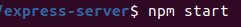

Sistema Operacional utilizado: Ubuntu 20.04

Nessa serie foi feito o uso de um servidor back-end, para começar a rodar este servidor basta utilizar o seguinte comando:

O restante da demostração de execução do programa está apresentada no README da parte front-end que se encontra na seguinte url **https://github.com/LeoLoboGomes/serie5-react**
